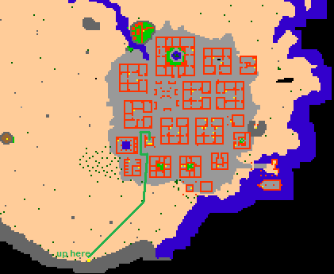
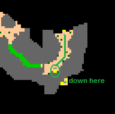
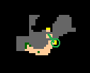
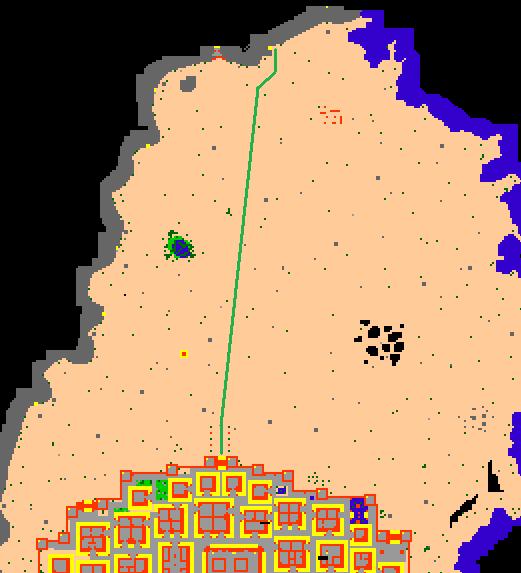

# Crossing Kha'labal

> ⚠️ Source: TibiaWiki (fandom) — **Tibia 7.4-era VANILLA**. Rivalia is custom; verify creatures/rewards/coords in-game or on wiki.rivaliaonline.com. Geography/routes are largely stable across versions but not guaranteed.

This page explains the route from Darashia to Ankrahmun (and/or back) through the continent of Darama via the Devourer, Kha'zeel northern pass, and the Kha'labal desert. You won't face many obstacles, most of the route is flat desert.

### Equipment needed:
None.

### Be prepared to face:
Sandcrawlers, Hyaenas, Nomads, Scorpions (Horestis' Curse), Honour Guards (Horestis' Curse), Scarabs (digging, raid), Larva (raid) , Ancient Scarabs (raid).

### Maps:
> 

> 

> 

> 

Note: the order of the maps is from Darashia to Ankrahmun, but if you want to go from Ankrahmun to Darashia you just need to follow the maps reversed.

See also other Routes.
