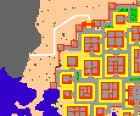
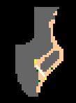
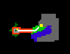
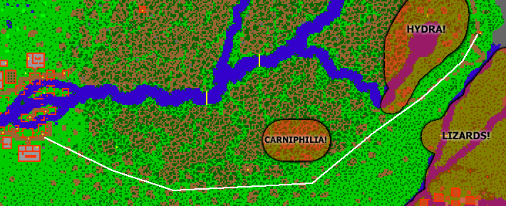

# Kha'zeel Pass

> ⚠️ Source: TibiaWiki (fandom) — **Tibia 7.4-era VANILLA**. Rivalia is custom; verify creatures/rewards/coords in-game or on wiki.rivaliaonline.com. Geography/routes are largely stable across versions but not guaranteed.

This is the above ground route to cross Kha'zeel mountain range. Note that there is also an underground route via the Darama Terramite Cave.
The pass connects the Kha'labal, the desert surrounding Ankrahmun, and Tiquanda, the jungle surrounding Port Hope.
*The monsters on Kha'labal side are Hyaenas, Nomads, and Bandits.
*The monsters on the Tiquanda side are Crocodiles, Elephants, a Spit Nettle, Tarantulas and maybe a lured Hydra.
****Note** Only those Creatures if you go for the right way.

*starting from Ankrahmun, you must climb over the mountains to the west, you will face Hyaenas here:

> 

> 

> 

> 

> 

> 

After having climbed up to the top of the mountain go over the bridge, there is 1 Nomad and some Bandits here:

> 

> 

There are no monsters here, just go down until reaching a ladder:

> 

> 

> 

> 

> 

Now you will proceed to the more dangerous part of the journey. Aiming to go straight west to town will usually take longer due to a lot of plants, trees and creatures blocking your way all the time. The way shown below goes outside the thickest parts.

You may encounter a lot of Spiders, Poison Spiders, Tarantulas, Centipedes, Wasps, Crocodiles, Spit Nettles, Dworcs, Elephants, Terror Birds and occacionally some Carniphilas. The more south you go, the easier and safer is the terrain and are the creatures.

**Watch out for lured Hydras!**

> 

See also other Routes.
