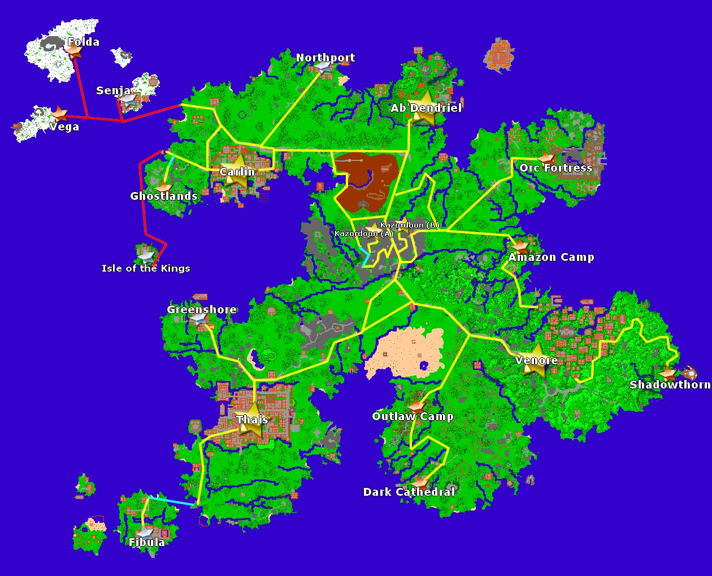

# Mainland Trails

> ⚠️ Source: TibiaWiki (fandom) — **Tibia 7.4-era VANILLA**. Rivalia is custom; verify creatures/rewards/coords in-game or on wiki.rivaliaonline.com. Geography/routes are largely stable across versions but not guaranteed.

### Advice
*Stay on the paths except for Thais - Venore and Kazordoon - Carlin
*Always carry a Rope and a Shovel. You never know what is going to happen.

### Be prepared to face
Creatures: Snake, Spider, Wolf, Bug, Poison Spider, Bear, Goblin, Dwarf, Starving Wolf, Poacher, Dwarf Soldier, Enraged White Deer.

Creatures: Orc, Centipede, Orc Spearman, Smuggler, Orc Warrior, Amazon, Wild Warrior, Boar, Bandit, Tarantula, Hunter, Orc Berserker, Orc Leader, Dragon.

### Routes
> 

See also: Traveling
