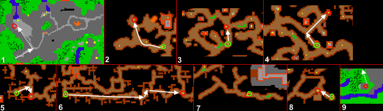
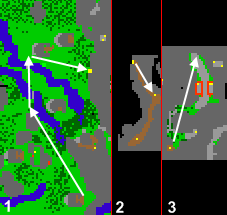

# Mount Sternum Passage

> ⚠️ Source: TibiaWiki (fandom) — **Tibia 7.4-era VANILLA**. Rivalia is custom; verify creatures/rewards/coords in-game or on wiki.rivaliaonline.com. Geography/routes are largely stable across versions but not guaranteed.

The following secret route can take you to another town and give you a chance to get exp at the same time.

### Thais-Kazordoon
Creatures: Cyclops, Bat, Skeleton, Ghoul, Bonelord, Dwarf, Dwarf Soldier, Dwarf Guard, Rotworm.

You may face Crypt Shamblers, Mummies and Ghosts if they are lured.

> 

#Go into Mount Sternum, where you will probably find Cyclops
#Now follow the way from green to red circles, here you might face all monsters listed above
#Then follow the map below

> 

### See also
*Luring
*Mount Sternum
