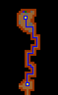
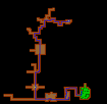
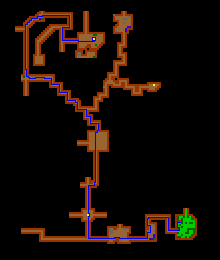
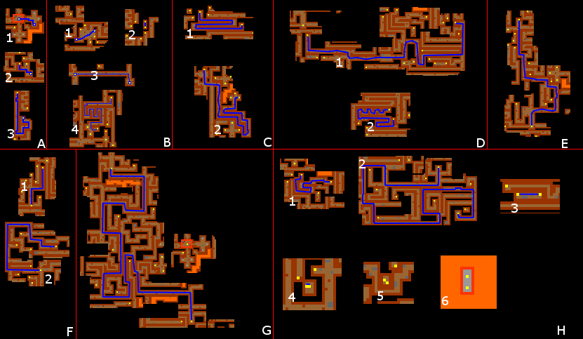
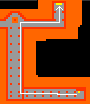
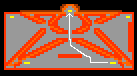
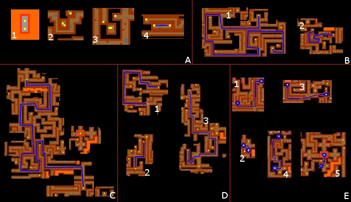
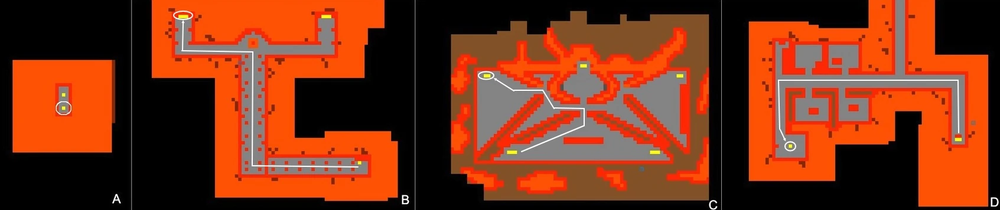

# Route: Demona

> ⚠️ Source: TibiaWiki (fandom) — **Tibia 7.4-era VANILLA**. Rivalia is custom; verify creatures/rewards/coords in-game or on wiki.rivaliaonline.com. Geography/routes are largely stable across versions but not guaranteed.

> 

 
There are several caves north of Carlin, in the Fields of Glory, that lead to the MoLS. For the case start at the cave a bit south of Northport (coords: 126.232 123.122 7 3), a small village north of Carlin. Use the shovel to open a hole (coords: 127.0 123.136 7 3) and get into it.

Follow the blue line until the next hole.

> 

Keep following the blue line and you'll find a small forest inside the cave. In the red spot, behind the trees, there is a hole and inside that hole there is a switch that you must turn right to open the entrance to the MoLS. Note: if it is already turned right, then turn it left and right again.

> 

Get out the hole and follow this way to get to the entrance of the MoLS. You will have to cross some Energy Fields.:

> 

Now you are inside of the MoLS and I suggest you that you follow the next the map step by step or you'll face dragons, dragon lords and giant spiders. In this path you'll face all the creatures in the list above (rats ~ orc leaders). Keep in mind: don't get out of the path if you can't face dangerous creatures.

> 

In the first entrance room is the Griffin Shield Quest. If you have not yet done it you can do so now. Keep going to the end of the passage and through the Gate of Expertise for level 60.

> 

Go north and take the right passage all the way to the stairs. Right above here is Demona.

> 

To get out of MoLS through the maze itself, you can follow the path in the map below. Note: there are other ways to get out of MoLS, but this is the  shortest path through the maze.

> 

Now you just have to follow the same path you used to go to MoLS to get out of the cave.

If you want to leave the area through Demona, you can follow the path below. Note: you might face many of the monsters present in the area, such as Warlocks.

> 
