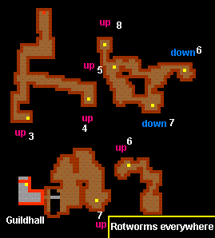
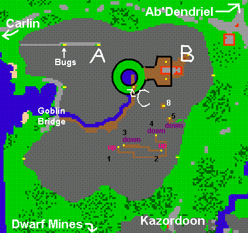
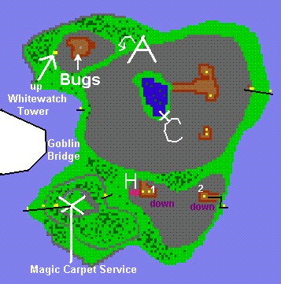
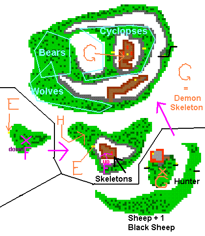

# Route:Femor Hills

> ⚠️ Source: TibiaWiki (fandom) — **Tibia 7.4-era VANILLA**. Rivalia is custom; verify creatures/rewards/coords in-game or on wiki.rivaliaonline.com. Geography/routes are largely stable across versions but not guaranteed.

The Femor Hills have very many Goblins as many Tibians know. But not every Tibian knows that there are also very dangerous monsters like hunters and demon skeletons, that is why in this article you can find escape routes, normal routes and Monster spawns.

### Equipment needed:
*A Rope

Only on some routes:
*A Shovel
*A Machete

### Be prepared to face:
Goblins, Wolves, Bears, Rotworms, Cyclopses, Hunters, Poison Spiders, Black Sheep.

### Maps:
> 

> 

**Note:** At the letter B is a hole and there are rumours talking about a goblin house with Goblins guarding a ring and an amulet.

> 

> 

### See also:
Traveling

Rings

Amulets

Magic Carpet
