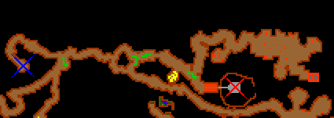
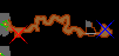
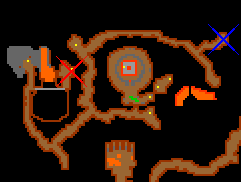
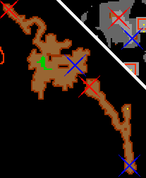
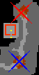
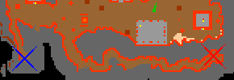
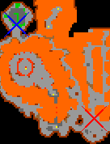
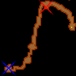

# Route:Hellgate

> ⚠️ Source: TibiaWiki (fandom) — **Tibia 7.4-era VANILLA**. Rivalia is custom; verify creatures/rewards/coords in-game or on wiki.rivaliaonline.com. Geography/routes are largely stable across versions but not guaranteed.

This article is about the route to get out of Hellgate. See Hellgate for the route to enter.

### Equipment needed
*A Rope
*6 Parcels or Levitate spell
*Key 3012 to enter Hellgate

### Be prepared to face
Spiders, Skeletons, Ghouls, Rotworms, Carrion Worms, Bonelords, Wasps, also lured: Demon Skeletons and Elder Bonelords.

### Routes
**Explanation of the pictures:**

Red cross = where you are when you go up or down.

Blue cross = where you are going to.

Once you get into Hellgate you will first be on a "platform" with a ladder, 
go up the ladder and you will be where the first picture shows. Now walk to the left
in a long corridor, you will only meet skeletons (unless you go north at the first crossing, then you will meet ghouls and up to 2 demon skeletons). Go down the hole at the end of the passage.

> 

Now go to the right in yet another long passage, there will be normal skeletons here. Then go down the hole.

> 

First go to the left, then around a long corridor until you get to the yellow circle, here go up with a rope.
On this path there will be regular spiders and skeletons. Straying from the route will lead to 5 elves and 2 elf scouts down one hole (and ~20 bugs if you go further down), and more spiders and eventually a giant spider in the other hole.

> 

Go to the south-east. Here you will meet a couple of Rotworms. Proceed down the hole, then a little to the south (2 Ghouls here) and up. Follow the path to the south (2 Ghouls and 2 Rotworms and some more of this kind later) and go up.

> 

Go to the south and then down the first hole you see. (The second roping spot has Poison Spiders and 1 Ghoul).

> 

Go to the left. Prepare to meet ~15 Ghouls, ~5 Skeletons and a ~2 Bonelords. Not all at once of course. In the big room you are about 
to enter are also Elder Bonelords so be careful, someone might have lured it closer to where you have to go.
(ADVICE: Try to keep close to the southern wall to avoid more monsters.) Then go down the hole.

> 

From here go north-west. You will meet NO monsters. Here you will need 6 parcels or Levitate spell
to climb up 2 floors, then go up the ladder.

> 

Now go to the south-west and up the hole. If you go the other hole (to the south-east) you can go down a few levels until you are at the level with all the lava. Then you can go up a few levels and meet 1 Ghoul and 1 Demon Skeleton and more (?).

> 

Once you made it here you might have to pull a switch, this is for the bridge you need to cross 1 floor up 
(it might already be open). From here you will meet a lot of Wasps, but otherwise
just look for your way up since there is only one way to go. You will come to the surface near Ab'Dendriel ((coords: 127.91 123.217 7 3)).

### Alternative route
There is also an alternative route to exit Hellgate.

This is through Draconia and Red Bone Castle.

To see this route look here.
