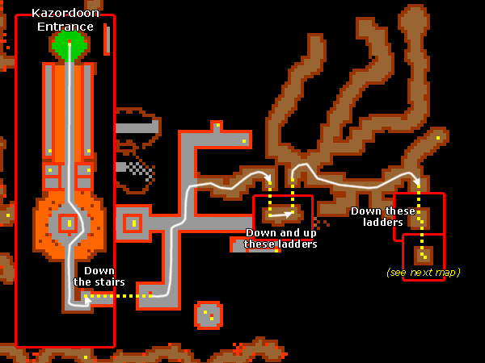
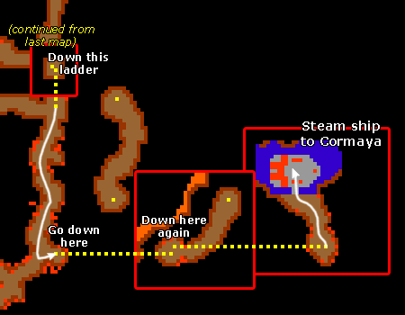

# Route:Kazordoon Steamship

> ⚠️ Source: TibiaWiki (fandom) — **Tibia 7.4-era VANILLA**. Rivalia is custom; verify creatures/rewards/coords in-game or on wiki.rivaliaonline.com. Geography/routes are largely stable across versions but not guaranteed.

This is the route to the Kazordoon Steam Boat. This might come in handy when doing the Postman Quest. Be prepared to face Bats, Rotworms, Dwarves and Dwarf Soldiers on your way through the mines.

> 

> 

**Note** there is also a less dangerous, but longer way where you won't face any Dwarf Soldiers.
**Note 2** You can also buy a ticket to the ore wagon, and then take the wagons from several places likes the depot, temple, main entrance or shops directly to the steamship, or indirectly from the magic carpet, and north/south/west surface entrances.
