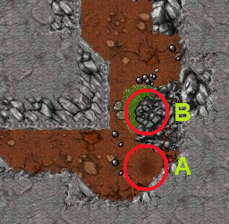
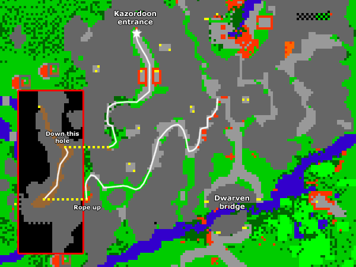
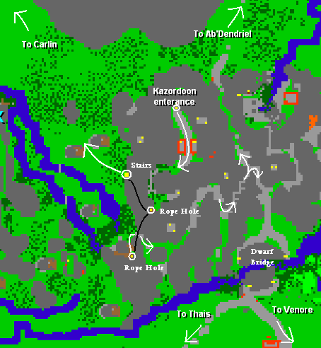
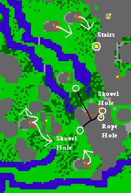

# Route:Kazordoon

> ⚠️ Source: TibiaWiki (fandom) — **Tibia 7.4-era VANILLA**. Rivalia is custom; verify creatures/rewards/coords in-game or on wiki.rivaliaonline.com. Geography/routes are largely stable across versions but not guaranteed.

> Note: After Updates/9.8 a lot of this info needs updating, because new iron ore wagons have been added.

Kazordoon is not known by all players, and really not every player knows how to pass it. Here you can find the routes around, through and in Kazordoon.

### Equipment needed:
*A Rope
*A Shovel

### Be prepared to face:
Poison Spiders, Spiders, Rotworms,  Wolves, Dwarfs, Dwarf Soldier on Dwarf Bridge.

### Advice
*Be aware of hidden holes:

> 

*A= Roping spot
*B= Hidden hole

### Routes:
#### Kazordoon Entrance
> 

#### City connections
> 

#### Dwarf Mine exit routes
> 

### See also:
*Travelling

*Dwarf Mines

*Steam Boat

*Dwarf Bridge
