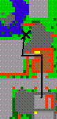
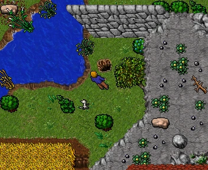
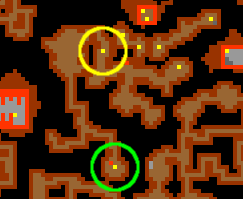
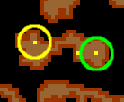
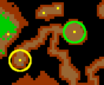
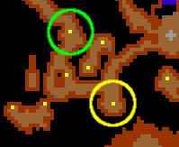
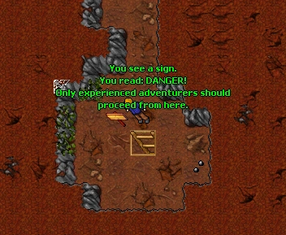
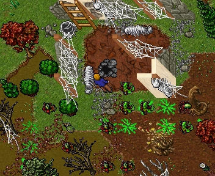
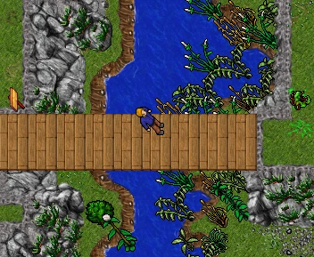

# Route:Level 1

> ⚠️ Source: TibiaWiki (fandom) — **Tibia 7.4-era VANILLA**. Rivalia is custom; verify creatures/rewards/coords in-game or on wiki.rivaliaonline.com. Geography/routes are largely stable across versions but not guaranteed.

### Introduction
On the northern bridge outside of town, there are switch tiles that may not be crossed by level 1s. This barrier is intended to protect new players. However, some players want to cross the bridge knowing the dangers on the other side. Before the introduction of The Beginning Quest the barrier was more significant. These days players are more likely to just complete the tutorial, thereby receiving more than enough experience to progress. Despite the various changes to make Rookgaard easier, the barrier still exists. This guide shows the passage around the bridge through a hidden cave. Players of any level can take this route, but players above level 1 could more easily cross the bridge.

Note that although level 1s can take this route, it is **not** a good idea without adequate preparation or another player to help. In the cave you will face Rats, Spiders, Bugs, Poison Spiders, Trolls and at the end you may face Wolves and Snakes. Note that the poison from poison spiders is particularly lethal for low levels. An Antidote Potion may be useful if you have one, but generally it is more efficient to buy Small Health Potions.

### Requirements
* Rope
* Antidote Potion or Small Health Potion (recommended).

### Route
* Go through the Rookgaard barn and down the pitfall north-east of the wheat field ((coords: 125.76 125.176 7 3)).
* Follow the cave south-west and go down the ladder. There is a single Spider down here.
* Rope up the hole on the west side of the room. Another Spider is up here. This rope hole blocks newcomers from getting stuck without a rope.
* Go down the ladder north-west. A single Poison Spider spawns here.
* Rope up the hole on the south-west end of the room. Here you will face a single Rat and one or more Spiders and Bugs. To the south is a spider and bug cave, but instead go north and follow the cave around, turning south-east when you can. You will find a ladder by a sign that warns you. Go down the ladder.
* On going down you will see a Dead Human, which contains Leather Legs. To the east is a Troll and 2 ladders down. Go down the eastern ladder.
* You're now in a troll cave. Go north and down the stairs. Beware, this is the hardest part of the cave.
* You may immediately find yourself with 3 Poison Spiders. The floor in total contains 3 Spiders and 6 Poison Spiders. Go up the ladder on the north-west end of the floor.
* This floor contains a few Trolls. Follow the cave all the way north and go up the ladder.
* Go north-east to find the next ladder. You will face a few Trolls and a Spider here. Go up the ladder.
* Go north-west, ignoring the ladder down and instead go up the next ladder to the surface.
* There are a bunch of Spiders here. You're now at the western part of Rookgaard wilderness ((coords: 125.58 125.91 7 3)). To go to the east part, cross the bridge on the top of the mountain to the south.

> 
> 
> 
> 
> 
> 
> 
> 
> 

### See also
* Travelling
