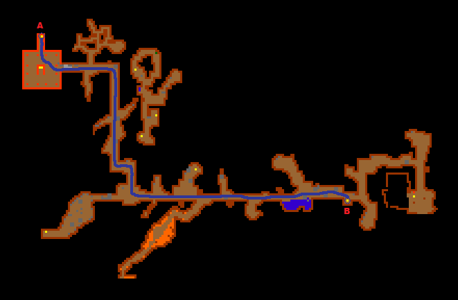
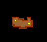
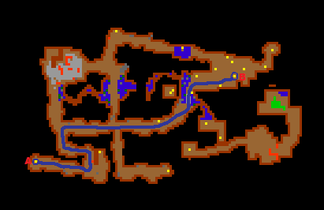
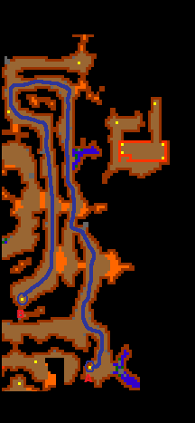
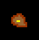
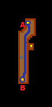
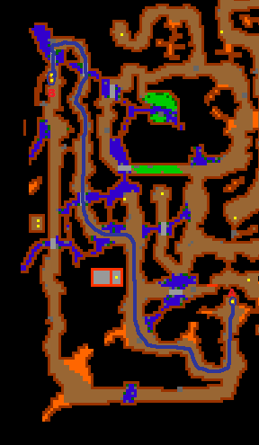
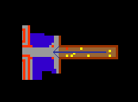
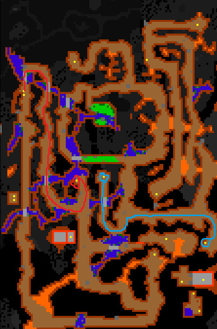

# Route:Mintwallin

> ⚠️ Source: TibiaWiki (fandom) — **Tibia 7.4-era VANILLA**. Rivalia is custom; verify creatures/rewards/coords in-game or on wiki.rivaliaonline.com. Geography/routes are largely stable across versions but not guaranteed.

* Go to the Ancient Temple, north of Thais ((coords: 126.100 125.171 7 3)).
* Go down two levels, and head as far north as you can go.
* Go down to the level with the Rotworms.
* Follow this path to the east and south, and go down the ladder:

> 

* On this level, there will be a lot of Poison Fields. You can either run through them and then use Antidote, or you can use Destroy Field to clear a path.

> 

* Go down another level.
* Follow this path to the east and north. Be careful for Minotaurs. Go down the hole that is circled on the map. You will face 2 Cyclopes down this hole:

> 

* After killing the Cyclopes you can now follow the maps, there won't be any monsters on this path (except maybe a Rat).

> 

> 

> 

> 

*Just follow the path which is set out with a blue line, you have to go from A to B.

> 

* Once you made it to the two ladder you can go down either one, then a couple of steps to the west and you will stand by the gate of Mintwallin.

> 

* When going back, you can take a shortcut through a hole with 2 Bonelords, to find it you need to follow the red line, and then proceed to exit following blue one. Also note - you can't go back to Mintwalin by using this route. The hole marked with red circle is a "blind" one - you can fall through it, but can't rope up there.
* 
> 
