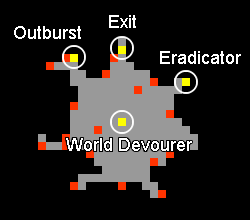
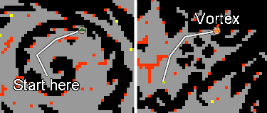
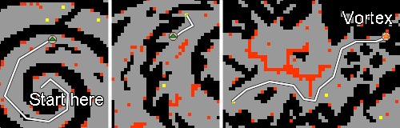
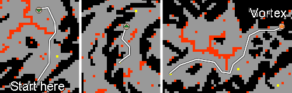
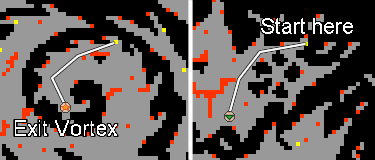

# Route:Otherworld

> ⚠️ Source: TibiaWiki (fandom) — **Tibia 7.4-era VANILLA**. Rivalia is custom; verify creatures/rewards/coords in-game or on wiki.rivaliaonline.com. Geography/routes are largely stable across versions but not guaranteed.

The Otherworld is a large area where it's easy to get lost, specially since there are three different entrances and some passages may change and prevent you from leaving through the same place you came in. A Spying Eye can be used to check which one of the three Glowing Vortexes are available to access or leave the Otherworld. On this page you'll find some of the common routes necessary to move around this area, specially if you're doing missions of the Heart of Destruction Quest.

If you get lost in the Otherworld, you can either go to the Vortex Hub and use a Temple Teleport there to leave, or use the routes to the hub to backtrack your way to the exit that is available at the moment. There are also other vortexes around the world that are not mentioned in this page, for example (coords: 125.103 122.170 13 4). These can be used if you get trapped in a room during an entrance change, however, the exactly locations in the Otherworld where they will send you to must be checked. 

### From the entrances to the initial bosses
On the maps below, you begin at the Star [map marker: orange star] and should go to the arrows [map marker: green arrow up][map marker: green arrow down] and cross [map marker: red cross] mark. 

#### Darama to Anomaly
> [minimap: x=125.124 y=122.130 z=12]
> [minimap: x=125.119 y=122.150 z=11]
> [minimap: x=125.107 y=122.124 z=12]

#### Zao to Rupture
> [minimap: x=125.118 y=122.124 z=13]
> [minimap: x=125.117 y=122.90 z=14]
> [minimap: x=125.116 y=122.128 z=13]

#### Svargrond to Realityquake
> [minimap: x=125.119 y=122.150 z=11]
> [minimap: x=125.140 y=122.157 z=12]
> [minimap: x=125.183 y=122.132 z=11]

### The Vortex Hub
> 

There is a vortex hub where players are sent after killing one of the 5 charge bosses, (coords: 125.162 122.96 11 2). This hub is a safe area which you can go to in case you want to leave using a Temple Teleport or if you need to wait for rescue. 

The northern red vortex marked as the exit will send you to the vortex shown below as the Hub's entrance, (coords: 125.162 122.95 11 4). To leave the Otherworld from the Hub, you can take this vortex and then follow the path backwards towards the Darama entrance below, even if the entrance isn't there. 

#### From Darama
> 

#### From Zao
> 

#### From Svargrond
> 

#### Leaving the Hub
Note: regardless of where the entrance to the Otherworld is, you can always leave the hub using this path towards the Darama entrance. 

> 

### Locations that become unreachable
There are three places (one for each entrance vortex) which can be blocked for passage. At any moment, only one of these three will be open, which is why each boss is bound to a city. The exact locations of the map changes are shown below. Notice that just next to the place where the wall appears there is a yellow dot which represents an emergency exit in case the player gets trapped inside that area. 

#### Darama - Anomaly
> [minimap: x=125.84 y=122.136 z=12]

#### Zao - Rupture
> [minimap: x=125.114 y=122.168 z=13]

#### Svargrond  - Realityquake
> [minimap: x=125.178 y=122.128 z=11]
