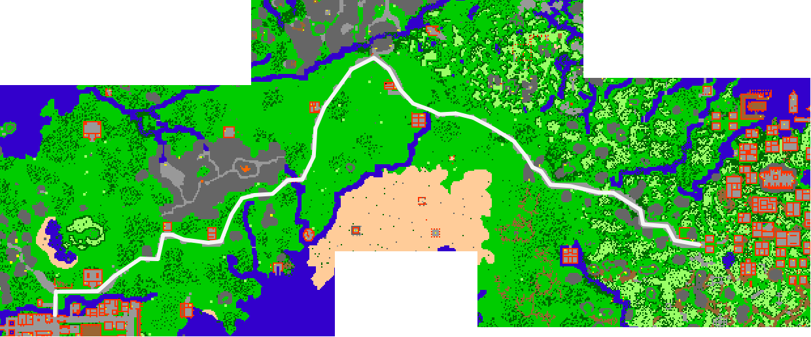

# Thaian-Venorean Road

> ⚠️ Source: TibiaWiki (fandom) — **Tibia 7.4-era VANILLA**. Rivalia is custom; verify creatures/rewards/coords in-game or on wiki.rivaliaonline.com. Geography/routes are largely stable across versions but not guaranteed.

## Overview

- **name:** Thaian-Venorean Road
- **implemented:** 7.1
- **city:** Thais
- **city:** Venore
- **notes:** The Thaian-Venorean Road is located on the mainland of Tibia and connects Thais with Venore. Buildings at this road are:

*Dark Mansion
*Mount Sternum Outlook Tower
*Lubo's Adventurer-Shop
*Postal Service Headquarters
*Mac Noodles
*Wolftower
*Venore Horse Station

Other nearby points of interest include:

*Thaian-Greenshore Road
*Thais Graveyard
*Alatar Lake
*Mount Sternum
*Triangle Tower
*Dwarven Bridge
*Jakundaf Desert
*Riverspring
*Venore Dragon Lair
- **map:** 
